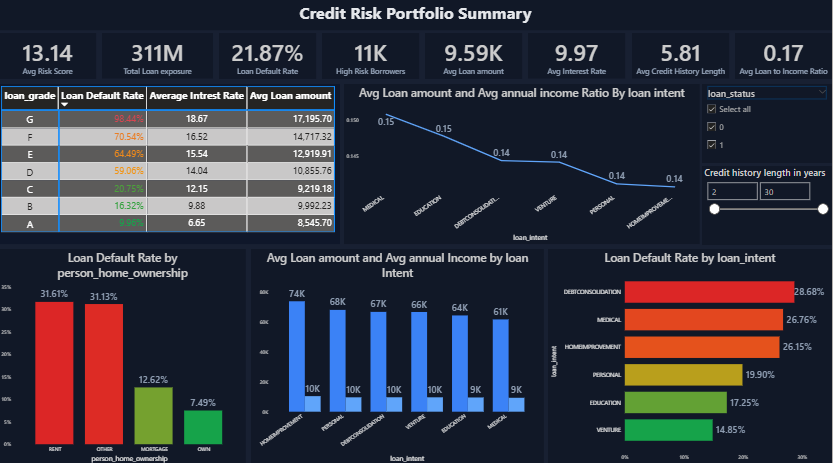
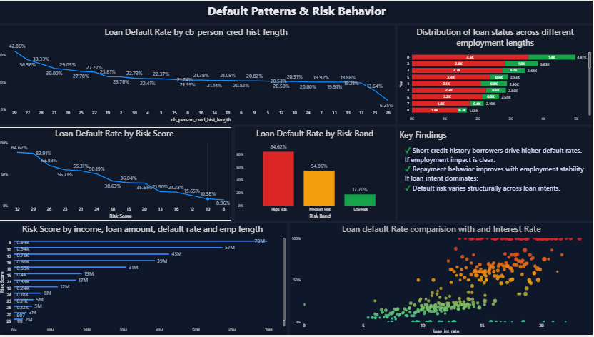

# 📊 Credit Risk Portfolio & Default Analysis Dashboard (Power BI)

## 🔹 Overview

This project showcases an **interactive Credit Risk & Loan Default Analysis Dashboard** developed using **Microsoft Power BI**.  
The dashboard is designed to analyze borrower risk characteristics, loan attributes, and default behavior to support **credit risk assessment and portfolio monitoring**.

The solution simulates a real-world **lending / financial analytics scenario**, focusing on identifying risk patterns and enabling data-driven business decisions.

---

## 🎯 Business Objective

Lending institutions must continuously monitor:

- Borrower risk levels  
- Loan default patterns  
- Portfolio exposure  
- Pricing effectiveness  

This dashboard helps stakeholders quickly evaluate **risk concentration, default drivers, and borrower behavior**.

---

## 🛠 Tools & Technologies

- **Microsoft Power BI**
- **Power Query** – Data Cleaning & Transformation
- **DAX (Data Analysis Expressions)** – Measures & Calculations
- **Data Modeling** – Relationships & Schema Design
- **Visual Analytics**

---

## 📁 Dataset Summary

The dataset (simulated lending data) includes:

- Risk Scores  
- Loan Amounts  
- Interest Rates  
- Loan Intent Categories  
- Credit History Length  
- Employment Length  
- Home Ownership  
- Loan Status (Default / Non-Default)

---

## 📈 Key Dashboard Components

### ✅ Portfolio Summary
- Average Risk Score  
- Total Loan Exposure  
- Loan Default Rate  
- High-Risk Borrowers  
- Average Loan Amount  
- Average Interest Rate  
- Credit History Metrics  

---

### ✅ Default & Risk Analysis
- Loan Default Rate by Loan Grade  
- Default Rate by Loan Intent  
- Default Rate by Credit History Length  
- Default Rate by Home Ownership  

---

### ✅ Risk Segmentation
- Loan Default Rate by Risk Band  
- Risk Score Distribution  
- Interest Rate vs Default Risk  

---

### ✅ Borrower Behavior Insights
- Income vs Loan Amount Patterns  
- Employment Length vs Loan Status  
- Multi-Factor Risk Indicators  

---

## 🔍 Analytical Insights

✔ Short credit history borrowers show higher default rates  
✔ Debt consolidation loans contribute significantly to defaults  
✔ Higher interest rates align with increased default probability  
✔ Risk bands effectively separate borrower risk profiles  
✔ Employment stability influences repayment behavior  

---

## 💼 Business Impact

This dashboard supports:

- Credit Risk Monitoring  
- Underwriting Strategy  
- Portfolio Risk Assessment  
- Risk-Based Pricing Analysis  
- Early Risk Detection  

---

## 📷 Dashboard Preview

### **Portfolio Summary View**

---

### **Default Patterns & Risk Behavior**

---

## 🔗 Power BI Service Report

👉 **Live Interactive Dashboard:**  
[link](https://app.powerbi.com/groups/me/reports/c447b6d5-0f88-46ea-90d2-671ba96eebec/9372a58693b46e6edca7?experience=power-bi)

---

## 🚀 Potential Business Actions

- Tighten approval criteria for high-risk segments  
- Reprice high-risk loan categories  
- Monitor short credit history borrowers  
- Optimize portfolio allocation strategies  

---

## 👤 Author

**Kandi Durga**  
Data Analyst | Power BI Developer

---

## ⭐ If you found this project useful, consider giving it a star!
